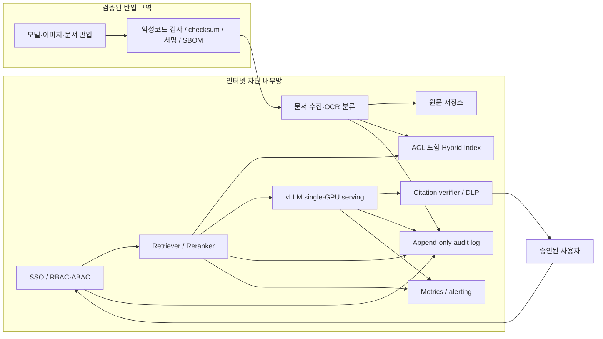

# Private Finance/Legal RAG Node

## 목표

은행·회계법인·법무법인의 기밀 문서를 외부 생성형 AI 서비스로 전송하지 않고,
내부망의 단일 GPU에서 검색·생성·감사까지 수행한다.

이 문서는 특정 규제의 준수를 선언하는 인증 문서가 아니다. 실제 조직의
보안정책, 개인정보 영향평가, 전자금융감독규정, 계약상 비밀유지 의무는 담당
부서와 별도로 확인한다.

## 신뢰 경계



핵심 원칙은 “LLM이 문서 권한을 판단하게 하지 않는다”이다. 사용자 권한은
retrieval 전에 강제하고, 검색 결과와 인용 원문 모두 같은 ACL 검사를 통과해야
한다.

## 오프라인 공급망

외부 네트워크에서 내부망으로 artifact를 가져올 때 다음 manifest를 만든다.

- model ID, immutable revision, license, 파일별 SHA-256
- tokenizer와 chat template revision
- container image digest와 SBOM
- Python/CUDA/vLLM 의존성 lock
- malware scan과 취약점 scan 결과
- 반입 승인자, 일시, 목적, 만료·교체 계획

운영 서버는 런타임에 Hugging Face나 package registry에 접속하지 않는다.
모델과 container는 내부 registry/object store에서만 받는다.

## 문서 수명주기

1. 승인된 drop zone으로 문서 반입
2. 악성 파일·암호화 파일·매크로 검사
3. OCR/parser 버전과 원문 checksum 기록
4. 개인정보·기밀등급·보존기간 분류
5. 원문 ACL을 chunk metadata에 상속
6. embedding model revision과 index build ID 기록
7. 검색 시 사용자·조직·matter/case 기준 ACL filter
8. 문서 변경·삭제 시 관련 chunk와 cache를 추적 삭제

평가 데이터에는 실제 고객·사건·거래 정보를 복사하지 않는다. 비식별 또는
합성 데이터를 사용하고, 운영 데이터로 재현 시험이 필요하면 별도의 승인과
삭제 절차를 둔다.

## 요청 경로

각 요청은 아래 식별자를 끝까지 유지한다.

```text
request_id
user/service identity
authorization policy revision
corpus/index version
retrieved document IDs and ACL decision
model/tokenizer/prompt revision
generation parameters
input/output policy result
latency and error status
```

감사 로그에는 비밀 원문이나 전체 prompt를 무조건 복제하지 않는다. 조사에
필요한 추적성과 개인정보 최소수집 원칙 사이에서 조직 정책에 맞는 필드와
보존기간을 정한다.

## 위협과 필수 테스트

| 위협 | 통제 | 포트폴리오에서 보여줄 테스트 |
|---|---|---|
| 다른 고객·사건 문서 노출 | retrieval 전 ACL/ABAC filter | 교차 사용자 검색 0건 |
| 문서 속 prompt injection | instruction/data 분리, 입력 분류, tool allowlist | 악성 문서 red-team set |
| 답변을 통한 정보 반출 | egress deny, DLP, 출력 정책 | 주민번호·계좌 패턴 차단 |
| 오염된 모델·이미지 반입 | digest pinning, signature, SBOM, scan | 변조 artifact 반입 실패 |
| 삭제 문서가 index/cache에 잔존 | lineage와 cascade deletion | 삭제 후 원문·검색·cache 0건 |
| 모델 변경으로 품질 저하 | versioned eval regression gate | 불합격 모델 배포 차단 |
| GPU OOM/과부하 | bounded queue, token limit, backpressure | 부하 상승 시 429와 복구 |
| 감사 불가능 | append-only event와 clock sync | 요청에서 근거·버전 역추적 |

## 단일 GPU 운영 특성

단일 GPU는 비용 효율 실험과 부서 단위 서비스에는 적합하지만 GPU 장애 중에도
무중단이어야 하는 핵심 업무의 고가용성을 제공하지 못한다. 따라서 보고서에는
다음을 분리한다.

- **Single-node SLO:** 정상 장비에서의 품질·지연시간·처리량
- **Recovery objective:** 장애 시 재기동/교체 후 복구 시간
- **HA architecture:** 실제 운영에서 필요하면 별도 노드·GPU와 라우팅 계층

Profile A/B/Reference는 single-node capacity profile이다. HA 등급이 아니다.

## 포트폴리오 데모 시나리오

1. 사용자 A는 감사 프로젝트 A의 문서만 검색한다.
2. 사용자 B가 같은 질문을 해도 프로젝트 A 문서는 검색되지 않는다.
3. 악성 지시가 삽입된 문서는 검색되더라도 시스템 지시를 바꾸지 못한다.
4. 14B AWQ와 32B 4-bit를 동시성 10에서 비교한다.
5. 품질·P95 TTFT gate를 통과한 가장 저렴한 profile을 선택한다.
6. 모델 revision 변경이 품질 회귀를 만들면 CI가 배포를 중단한다.
7. 감사 화면에서 답변의 문서·index·prompt·model revision을 역추적한다.

이 시나리오를 끝까지 구현하면 “RAG를 만들었다”가 아니라 “기밀 RAG를
운영 가능한 형태로 통제했다”는 증거가 된다.

